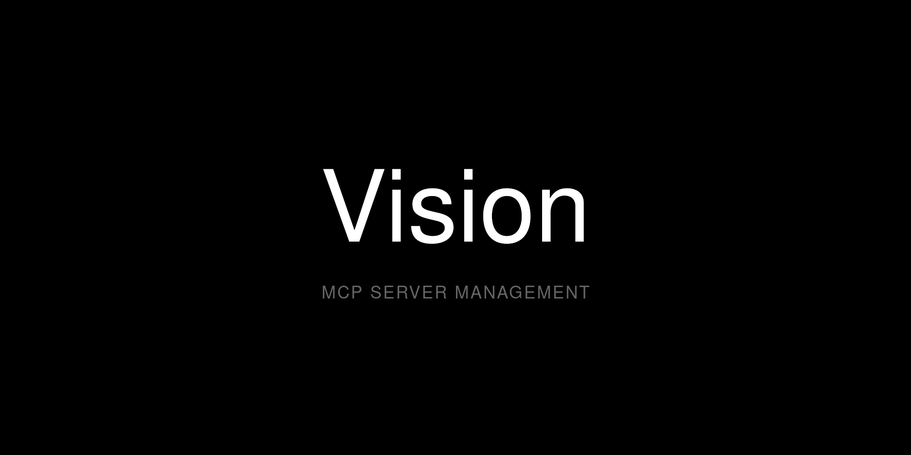

<p align="center">
  
</p>

<p align="center">
  <strong>The MCP Control Plane for Agentic Coding</strong>
</p>

<p align="center">
  <a href="https://go.dev/"></a>
  <a href="LICENSE"></a>
</p>

Vision turns MCP servers from a configuration nightmare into a supervised, agent-accessible control plane. One daemon. One config. Full agent autonomy with complete operator oversight.

## The Problem

Using MCP servers with AI coding agents today means:

- **Scattered configurations** — Each project has its own MCP setup, duplicated across machines
- **Manual process management** — Servers crash silently, requiring manual restarts
- **No visibility** — Which tools are running? What's failing? No central place to look
- **Static tooling** — Agents can't adapt their capabilities; humans must edit configs
- **Transport chaos** — stdio servers can't be shared across clients without a proxy layer

## The Solution

Vision is a Go-native daemon that provides:

| Capability | What It Means |
|------------|---------------|
| **Centralized Registry** | One YAML file (`~/.config/vision/servers.yaml`) defines all your MCP servers |
| **Process Supervision** | Erlang-style supervision with automatic restarts and exponential backoff |
| **Streamable HTTP Proxy** | Per-session subprocess isolation—each client gets its own MCP process on a dedicated port |
| **Automatic Respawn** | If a downstream subprocess is reaped or crashes, the next tool call transparently spawns a fresh one |
| **Agent Self-Management** | AI agents can add, remove, and restart servers through the Admin MCP API |
| **Hot Reload** | Update configuration without restarting your coding session |

## Why Vision?

Vision turns any MCP-compatible agent into a **high-agency system with guardrails**:

```
You: "Research best practices for React Server Components"

Agent: [Calls vision_list — no documentation server available]
Agent: [Calls vision_search("documentation") — finds context7]
Agent: [Calls vision_add("context7", start=true)]
Agent: [Now has Context7 available — proceeds with research]
```

No human intervention. No config file edits. The agent adapts to what it needs.

**But you stay in control:**
- All servers are defined in your central config
- The Admin API only exposes servers you've pre-approved in the catalog
- Every process is supervised and logged
- One `vision daemon status` shows everything

## Comparison

| Feature | Vision | MCP Gateway | Direct Config |
|---------|--------|-------------|-------------------|
| Agent self-management | Yes | No | No |
| Process supervision | Yes (Erlang-style) | Varies | No |
| Automatic restarts | Yes | Varies | No |
| Hot reload | Yes | No | No |
| Central config | Yes | Yes | No (per-project) |
| Streamable HTTP proxy | Yes | Some | No |
| Per-session isolation | Yes | No | No |
| Admin MCP API | Yes | No | N/A |
| Single binary | Yes | Varies | N/A |

## Quick Start

```bash
# Install Vision
curl -fsSL https://raw.githubusercontent.com/Sharper-Flow/Vision-MCP-Manager/trunk/scripts/install.sh | bash

# Start the daemon (with example servers)
vision daemon start -d

# Add the Vision remote to OpenCode's project `opencode.jsonc` or global
# `~/.config/opencode/opencode.jsonc` configuration.
```

Your AI agent can now connect to Vision-managed servers at `http://localhost:627X/mcp`.

## Installation

### One-Line Install (Recommended)

```bash
curl -fsSL https://raw.githubusercontent.com/Sharper-Flow/Vision-MCP-Manager/trunk/scripts/install.sh | bash
```

The installer downloads the latest binary, places it in `/usr/local/bin`, and creates the configuration directory.
When it installs the systemd unit, it also captures your current `PATH` so shell-managed MCP binaries (for example `pyenv`, `nvm`, or `uvx` tools) remain spawnable under systemd.

**Options:**
- `--systemd` — Install and enable the systemd user service

### From Source

```bash
git clone https://github.com/Sharper-Flow/Vision-MCP-Manager.git
cd Vision-MCP-Manager
make build
sudo cp bin/vision /usr/local/bin/
```

**Requirements:** Go 1.24+

### Running as a Service

For always-on operation, install the systemd user service:

```bash
mkdir -p ~/.config/systemd/user
cp scripts/vision-user.service ~/.config/systemd/user/vision.service
systemctl --user daemon-reload
systemctl --user enable --now vision
```

If your MCP commands live outside the default systemd path, reinstall with `scripts/install.sh` or add a matching `PATH` to `~/.config/systemd/user/vision.service` before starting the daemon.

## Configuration

### Server Registry

Vision maintains a central registry at `~/.config/vision/servers.yaml`:

```yaml
servers:
  # Context7 - Library documentation lookup
  context7:
    port: 6276
    command: context7-mcp
    args: []
    env:
      CONTEXT7_API_KEY: "${CONTEXT7_API_KEY}"
    autostart: true
    session_timeout: 30m   # How long idle sessions live (default: 5m)

  # Kagi - Web search and summarization
  kagi:
    port: 6279
    command: uvx
    args: ["--python", "3.12", "kagimcp"]
    env:
      KAGI_API_KEY: "${KAGI_API_KEY}"
    autostart: true

  # Time - Timezone utilities
  time:
    port: 6282
    command: uvx
    args: ["mcp-server-time", "--local-timezone=America/New_York"]
    autostart: true
```

> **Session lifecycle:** Idle sessions are reaped after `session_timeout` (default 5m). If a tool call arrives after the session is reaped, Vision automatically respawns a fresh subprocess — no error is returned to the agent.

> **Availability profiles:** Set `availability_profile: networked` for servers backed by upstream web/API providers. Vision applies stronger timeout, retry, circuit-breaker, cache, and in-flight limit defaults while still keeping per-session downstream isolation by default.

> **Slot groups:** For servers that need concurrent process-per-session isolation (e.g. Playwright browser automation), declare a `slot_groups` pool in `servers.yaml`. Vision expands the pool into identical slots behind a single virtual port and transparently routes each session to the least-loaded healthy slot — agents connect to one endpoint and never see the underlying processes. See [Configuration Reference](docs/CONFIGURATION.md#slot-groups) for the full schema and examples.

### API Keys and Secrets

Store API keys in `~/.config/vision/.env` and reference them via `${VAR}` in `servers.yaml`:

```bash
# ~/.config/vision/.env (0600 permissions)
CONTEXT7_API_KEY=your-context7-key
KAGI_API_KEY=your-kagi-key
```

```yaml
# ~/.config/vision/servers.yaml
env:
  CONTEXT7_API_KEY: "${CONTEXT7_API_KEY}"
```

Vision loads `.env` before parsing the config, so `${VAR}` expansion works regardless of how the daemon is started (foreground, background, systemd). The `.env` file should have `0600` permissions since it contains secrets.

> **Important:** After changing `.env`, reload is not always sufficient for already-running downstream subprocesses. New spawns will use the updated values, but long-lived MCP server processes may keep the old environment until they are restarted. After rotating API keys or tokens, prefer a full `vision daemon restart` flow (`vision daemon stop` → `vision daemon start`) or restart the affected server/session before validating the change.

For producer-owned remote MCPs like Grep by Vercel, prefer configuring the official remote endpoint directly in your client instead of wrapping it in a local subprocess. If you intentionally want Vision to proxy a remote MCP, use `transport: http` with `url:` in `servers.yaml`.

### Client Integration

Connect any MCP-compatible client to Vision-managed servers via Streamable HTTP:

```json
{
  "mcp": {
    "vision": {
      "type": "remote",
      "url": "http://localhost:6275/mcp",
      "enabled": true
    },
    "context7": {
      "type": "remote",
      "url": "http://localhost:6276/mcp",
      "enabled": true
    },
    "kagi": {
      "type": "remote",
      "url": "http://localhost:6279/mcp",
      "enabled": true
    }
  }
}
```

For OpenCode, place this declaration in the project `opencode.json`/
`opencode.jsonc`, or in `~/.config/opencode/opencode.jsonc` for global use.
When the Vision OpenCode plugin's `vision_init` omits `path`, it detects a sole
existing root `opencode.jsonc`/`opencode.json` or
`.opencode/opencode.jsonc`/`.opencode/opencode.json`; with none it uses root
`opencode.jsonc`, and with multiple it requires an explicit path. Explicit
relative plugin paths resolve against the project directory, while direct Admin
MCP callers must pass an absolute `path`. Existing JSONC comments and trailing
commas are preserved during reconciliation.

## External Configuration

Vision's `~/.config/vision/servers.yaml` can be written by external configuration tools as well as edited by hand.

**Contract for external writers:**

- `servers.yaml` is **authoritative** on reload. Vision does not merge with prior state — what's in the file is what runs.
- Use atomic writes (write to a temp file in the same directory, then rename).
- Validate against the documented schema (`internal/config/schema.go`) before writing.
- Preserve unknown but reserved fields (e.g. `source`, `description`, `retry.*`, `circuit_breaker.*`) on round-trip when re-rendering from a higher-level source.
- The admin HTTP surface at `http://127.0.0.1:6275` exposes stable integration endpoints: `GET /version` (capability contract), `GET /health` (aggregate status), `GET /v1/servers` (per-server status), and `GET /v1/servers/{name}` (single server detail).
- Check `GET /version` for the `api.*` capability flags before calling endpoints — this lets external tools feature-detect without pinning Vision versions.

## Agent Self-Management

Vision's killer feature: **agents can manage their own tools**.

The Admin MCP Server (port 6275) exposes these tools to your AI agent:

| Tool | What It Does |
|------|--------------|
| `vision_list` | Show all servers with status (running/stopped/error) |
| `vision_add` | Provision and start a new server from the catalog |
| `vision_remove` | Stop and remove a server |
| `vision_search` | Find servers by name or capability |
| `vision_status` | Daemon health, uptime, memory usage |
| `vision_guidance` | Get recommendations for which tool to use |

**Example workflow:**

1. Agent needs web search capability
2. Calls `vision_search("web search")` → finds `kagi`
3. Calls `vision_add("kagi", start=true)` → server starts
4. Agent now has web search available
5. You see it in `vision_list` — full visibility

## Architecture

```
┌─────────────────────────────────────────────────────────────────┐
│                        AI Agents                                │
│              (OpenCode, Claude Code, Cursor, etc.)              │
└───────────────────────────────┬─────────────────────────────────┘
                                │ HTTP POST/GET/DELETE /mcp
                                ▼
┌─────────────────────────────────────────────────────────────────┐
│                       Vision Daemon                             │
│                                                                 │
│   ┌─────────────────────────────────────────────────────────┐   │
│   │           Admin MCP Server (:6275)                      │   │
│   │   vision_list  vision_add  vision_status  vision_search │   │
│   └─────────────────────────────────────────────────────────┘   │
│                                                                 │
│   ┌─────────────────────────────────────────────────────────┐   │
│   │          Streamable HTTP Proxy Layer                    │   │
│   │                                                         │   │
│   │  :6276/mcp ──[session A]──> subprocess A (stdio)        │   │
│   │            ──[session B]──> subprocess B (stdio)         │   │
│   │                                                         │   │
│   │  :6284/mcp ──[session C]──> subprocess C (stdio)        │   │
│   │                                                         │   │
│   │  :6282/mcp ──[session D]──> subprocess D (stdio)  ...   │   │
│   └─────────────────────────────────────────────────────────┘   │
│                                                                 │
│   ┌─────────────────────────────────────────────────────────┐   │
│   │         Process Supervisor (Erlang-style)               │   │
│   │   Automatic restarts · Exponential backoff · Graceful   │   │
│   │   teardown: stdin close → SIGTERM → SIGKILL             │   │
│   └─────────────────────────────────────────────────────────┘   │
└─────────────────────────────────────────────────────────────────┘
```

**Key components:**

1. **Admin MCP Server** — Lets agents manage their own tooling without human intervention
2. **Streamable HTTP Proxy** — Each client session spawns an isolated subprocess; tools are discovered dynamically and proxied transparently. If a subprocess is reaped (idle timeout) or crashes, the proxy automatically respawns it on the next request
3. **Process Supervisor** — Uses [suture](https://github.com/thejerf/suture) for automatic restarts with backoff
4. **Security Middleware** — Bearer auth, origin allowlist, rate limiting, body size caps, and session admission control

## Trust Through Visibility

High-agency doesn't mean black-box. Vision gives you:

- **Centralized config** — Know exactly what tools are available (`~/.config/vision/servers.yaml`)
- **Process supervision** — Every server is monitored; crashes trigger automatic restarts
- **Single daemon** — One place to check status: `vision daemon status`
- **Dedicated ports** — Each server isolated on its own port for security and debugging
- **Hot reload** — Update config without disrupting active sessions: `vision daemon reload`

## CLI Reference

### Daemon

```bash
vision daemon start        # Start in foreground
vision daemon start -d     # Start daemonized
vision daemon stop         # Graceful shutdown
vision daemon status       # Health, uptime, memory
vision daemon reload       # Hot-reload config (SIGHUP)
```

### Servers

```bash
vision server list                    # Show all servers
vision server add <name> --command <cmd> [--args <args>]
vision server remove <name>
vision server start <name>
vision server stop <name>
```

### Configuration

Client configuration generation is provided by the OpenCode plugin's
`vision_init` tool, not the Vision CLI. With `path` omitted, the plugin detects a
sole existing recognized project config (root `opencode.jsonc`/`opencode.json`
or `.opencode/opencode.jsonc`/`.opencode/opencode.json`), uses root
`opencode.jsonc` when none exists, and requires an explicit path when multiple
exist. Relative plugin paths resolve against the project directory; direct
Admin MCP callers must provide an absolute path.

## Troubleshooting

| Symptom | Solution |
|---------|----------|
| Server not responding | `vision daemon status` — check if daemon is running |
| Server keeps crashing | Check logs: `journalctl --user -u vision -f` |
| Config changes not applied | Run `vision daemon reload` |
| Port already in use | Check for conflicts: `lsof -i :6276` |
| "downstream session unavailable" | Session was reaped after idle timeout. Vision auto-respawns on next call. If persistent, increase `session_timeout` in `servers.yaml` |

## Documentation

- [Configuration Reference](docs/CONFIGURATION.md) — Complete server options
- [AI Agents Guide](docs/agents.md) — Deep dive into agent integration
- [MCP Transports](docs/MCP_TRANSPORTS.md) — Streamable HTTP proxy and per-session subprocess model
- [MCP 2026-07-28 Alignment Decision](docs/decisions/0001-mcp-2026-07-28-alignment.md) — Stateless transport migration and isolation stance
- [Development Guide](DEVELOPMENT.md) — Building and contributing

## Roadmap

- [x] Structured audit logging for session lifecycle and security events
- [x] Per-session admission controls (max concurrent sessions, idle timeout, TTL)
- [x] Automatic downstream respawn on idle reap or crash
- [x] Document MCP 2026-07-28 alignment and migration trigger
- [ ] Usage analytics dashboard
- [ ] Multi-machine sync

## License

MIT License — see [LICENSE](LICENSE) for details.

---

<p align="center">
  <sub>Built with Go. Designed for agentic coding.</sub>
</p>
